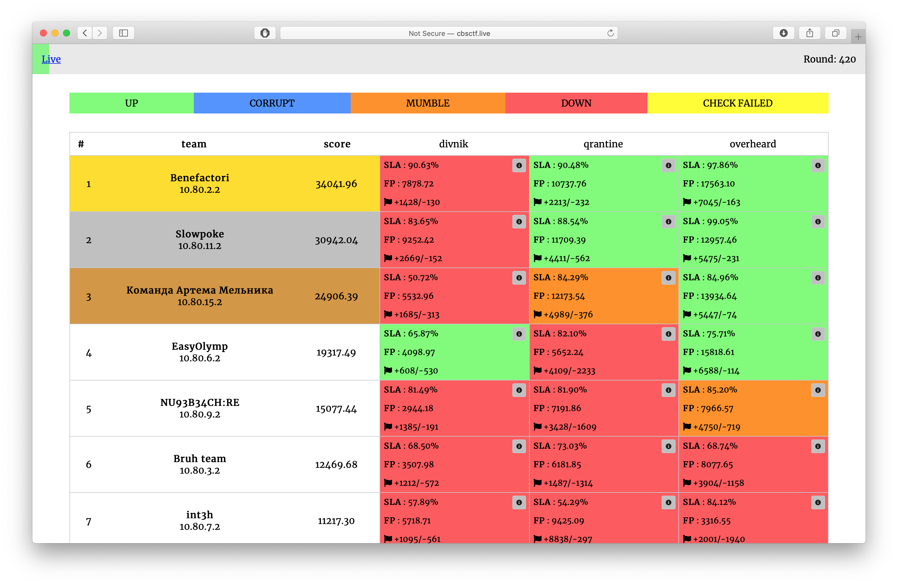

# InnoCTF School 2020 Final

A school A&D competition held on May 10, 2020.

Repository contains source code of services, checkers and sploits.

## Results

[Full scoreboard](scoreboard/full.png)

## Services

| Service | Language | Checker | Sploits | Authors |
|---------|----------|---------|---------|---------|
| **[divnik](services/divnik/)** | Python + Django | [Checker](checkers/divnik/) | [Sploits](sploits/divnik/) | [@pomo_mondreganto](https://github.com/pomo-mondreganto) |

## Infrastructure

- DevOps: [@pomo_mondreganto](https://github.com/pomo-mondreganto)
- Checksystem: [ForcAD](https://github.com/pomo-mondreganto/ForcAD)
